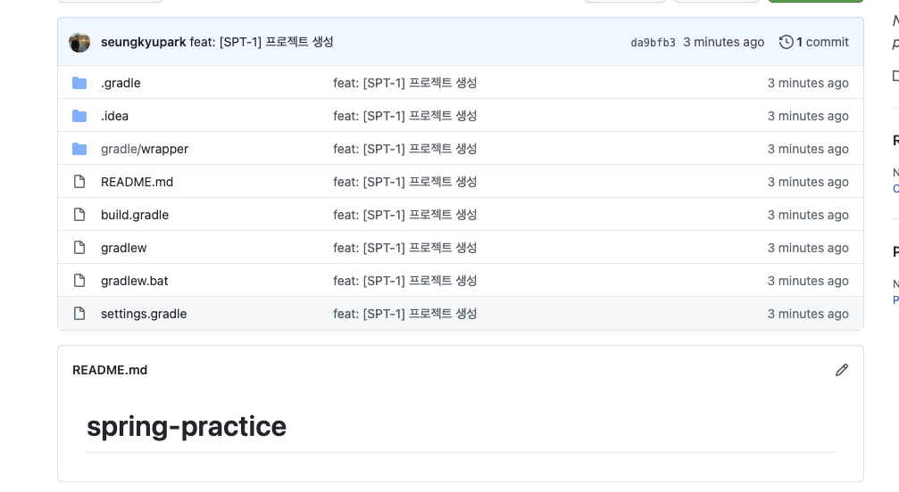
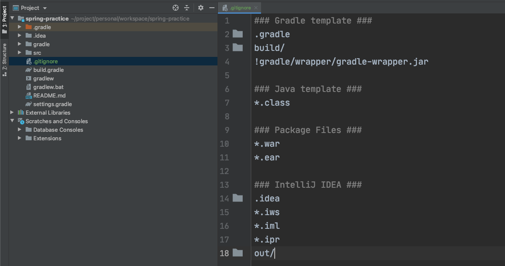
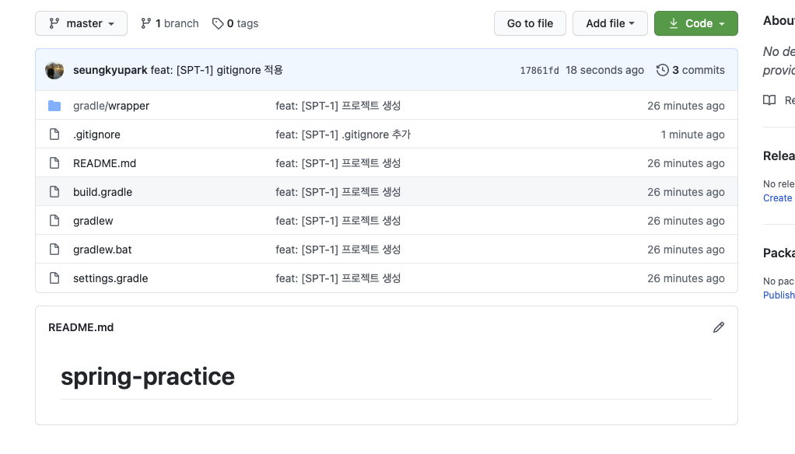

# .gitignore 적용하기

Created: Dec 23, 2020 8:38 PM

## 목차
1. [gitignore이란?](#gitignore이란)
2. [왜 gitignore을 사용하는가?](#왜-gitignore을-사용하는가)
3. [.gitignore 파일 생성](#gitignore-파일-생성)
4. [.gitignore 파일 적용](#gitignore-파일-적용)
5. [간단히 .gitignore 파일 생성](#간단히-gitignore-파일-생성)

## gitignore이란?

> - 프로젝트 작업시 로컬 환경의 정보나 빌드 정보등 원격 저장소에 관리하지 말아야되는 파일들에 대해서 지정하여 원격 저장소에 실수로 올라가지 않도록 관리하는 파일
> - 정의한 정보들에 해당하는 파일들에 대하여 git track하지 않도록 설정하는 역할을 한다.

- 다양한 환경에서의 샘플 gitignore는 [https://github.com/github/gitignore](https://github.com/github/gitignore) 에서 확인할수 있다.

## 왜 gitignore을 사용하는가?

- 처음 프로젝트 생성후 생성한  git repository에 push를 하면 아래와 같이 push가 된다.



- 위의 push된 내용을 보면 알수 있듯이 원격 저장소에서는 **관리하지 않아도될 idea관련 파일이라든지 gradle 관련 파일들**이 함께 push된것을 확인할수 있다.
- 이런 로컬 개발 환경에 종속적인 파일은 원격 저장소에서 관리될 필요가 없다.
- 이렇듯 프로젝트에서 관리가 필요하지 않은 파일에 대해서 git에서 추척하지 않게 제외시키기 위해 gitignore파일을 이용하여 관리를 하려고 한다.

## .gitignore 파일 생성

- .gitignore 파일은 프로젝트 최상위 위치에 존재해야한다.
- 아래의 패턴을 활용하여 **git이 untracked할 파일 또는 디렉토리등을 정의**하여 파일을 생성한다.

### 패턴

작성 패턴은 아래의 규칙을 따른다. 

> - '#'로 시작하는 라인은 무시한다.
> - 표준 Glob 패턴을 사용한다.
> - 슬래시(/)로 시작하면 하위 디렉터리에 적용되지(recursivity) 않는다.
> - 디렉터리는 슬래시(/)를 끝에 사용하는 것으로 표현한다.
> - 느낌표(!)로 시작하는 패턴의 파일은 무시하지 않는다.

- example

```
# ignore all .class files
*.class

# exclude lib.class from "*.class", meaning all lib.class are still tracked
!lib.class

# ignore all json files whose name begin with 'temp-'
temp-*.json

# only ignore the build.log file in current directory, not those in its subdirectories
/build.log

# specify a folder with slash in the end
# ignore all files in any directory named temp
temp/

# ignore doc/notes.txt, but not doc/server/arch.txt
bin/*.txt

# ignore all .pdf files in the doc/ directory and any of its subdirectories
# /** matches 0 or more directories
doc/**/*.pdf
```



## .gitignore 파일 적용

- 작성한 .gitignore을 commit하여 원격 저장소에 push한다.
- push후 gitignore적용이 되지 않을경우 아래의 명령어를 통해 원격 저장소 파일을 제거후 다시 push한다.

```
git rm -r --cached .
git add. 
git commit -m "커밋메세지"
git push origin {브랜치명}
```



- 적용후 위와 같이 기존에 있던 불필요했던 파일 또는 디렉토리가 제거 된것을 확인할 수 있다.
- 그리고 이후 추가되지 않아야되는 정보는 추가하여 실수로 잘못된 파일이 원격 저장소에 올라가는것을 방지 할수 있다.

## 간단히 .gitignore 파일 생성

- [https://www.gitignore.io/](https://www.gitignore.io/)  를 이용하여 원하는 ignore 파일을 생성할수 있다.
- 아래는 예로 gradle, intellij, java에 대한 ignore 파일을 생성하는 모습입니다.

    

- 위와 같이 gitignore에 추가될 정보를 추가하여 생성을 클릭하면 아래와 같이 파일이 생성된다.

<details markdown="1">
<summary>생성파일</summary> 

```
# Created by https://www.toptal.com/developers/gitignore/api/intellij,gradle,java
# Edit at https://www.toptal.com/developers/gitignore?templates=intellij,gradle,java

### Intellij ###
# Covers JetBrains IDEs: IntelliJ, RubyMine, PhpStorm, AppCode, PyCharm, CLion, Android Studio, WebStorm and Rider
# Reference: https://intellij-support.jetbrains.com/hc/en-us/articles/206544839

# User-specific stuff
.idea/**/workspace.xml
.idea/**/tasks.xml
.idea/**/usage.statistics.xml
.idea/**/dictionaries
.idea/**/shelf

# Generated files
.idea/**/contentModel.xml

# Sensitive or high-churn files
.idea/**/dataSources/
.idea/**/dataSources.ids
.idea/**/dataSources.local.xml
.idea/**/sqlDataSources.xml
.idea/**/dynamic.xml
.idea/**/uiDesigner.xml
.idea/**/dbnavigator.xml

# Gradle
.idea/**/gradle.xml
.idea/**/libraries

# Gradle and Maven with auto-import
# When using Gradle or Maven with auto-import, you should exclude module files,
# since they will be recreated, and may cause churn.  Uncomment if using
# auto-import.
# .idea/artifacts
# .idea/compiler.xml
# .idea/jarRepositories.xml
# .idea/modules.xml
# .idea/*.iml
# .idea/modules
# *.iml
# *.ipr

# CMake
cmake-build-*/

# Mongo Explorer plugin
.idea/**/mongoSettings.xml

# File-based project format
*.iws

# IntelliJ
out/

# mpeltonen/sbt-idea plugin
.idea_modules/

# JIRA plugin
atlassian-ide-plugin.xml

# Cursive Clojure plugin
.idea/replstate.xml

# Crashlytics plugin (for Android Studio and IntelliJ)
com_crashlytics_export_strings.xml
crashlytics.properties
crashlytics-build.properties
fabric.properties

# Editor-based Rest Client
.idea/httpRequests

# Android studio 3.1+ serialized cache file
.idea/caches/build_file_checksums.ser

### Intellij Patch ###
# Comment Reason: https://github.com/joeblau/gitignore.io/issues/186#issuecomment-215987721

# *.iml
# modules.xml
# .idea/misc.xml
# *.ipr

# Sonarlint plugin
# https://plugins.jetbrains.com/plugin/7973-sonarlint
.idea/**/sonarlint/

# SonarQube Plugin
# https://plugins.jetbrains.com/plugin/7238-sonarqube-community-plugin
.idea/**/sonarIssues.xml

# Markdown Navigator plugin
# https://plugins.jetbrains.com/plugin/7896-markdown-navigator-enhanced
.idea/**/markdown-navigator.xml
.idea/**/markdown-navigator-enh.xml
.idea/**/markdown-navigator/

# Cache file creation bug
# See https://youtrack.jetbrains.com/issue/JBR-2257
.idea/$CACHE_FILE$

# CodeStream plugin
# https://plugins.jetbrains.com/plugin/12206-codestream
.idea/codestream.xml

### Java ###
# Compiled class file
*.class

# Log file
*.log

# BlueJ files
*.ctxt

# Mobile Tools for Java (J2ME)
.mtj.tmp/

# Package Files #
*.jar
*.war
*.nar
*.ear
*.zip
*.tar.gz
*.rar

# virtual machine crash logs, see http://www.java.com/en/download/help/error_hotspot.xml
hs_err_pid*

### Gradle ###
.gradle
build/

# Ignore Gradle GUI config
gradle-app.setting

# Avoid ignoring Gradle wrapper jar file (.jar files are usually ignored)
!gradle-wrapper.jar

# Cache of project
.gradletasknamecache

# # Work around https://youtrack.jetbrains.com/issue/IDEA-116898
# gradle/wrapper/gradle-wrapper.properties

### Gradle Patch ###
**/build/

# End of https://www.toptal.com/developers/gitignore/api/intellij,gradle,java
``` 

</details>
    

- 프로젝트 생성 초반 간단하게 .gitignore 파일을 생성할때 활용하면 좋을듯 하다.

### 참고

- [https://www.gitignore.io/](https://www.gitignore.io/)
- [https://github.com/github/gitignore](https://github.com/github/gitignore)
- [https://git-scm.com/docs/gitignore](https://git-scm.com/docs/gitignore)
- [https://www.atlassian.com/git/tutorials/saving-changes/gitignore](https://www.atlassian.com/git/tutorials/saving-changes/gitignore)
- [https://www.gloomycorner.com/tag/ignore/](https://www.gloomycorner.com/tag/ignore/)